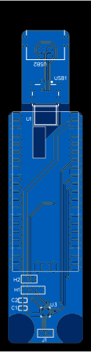
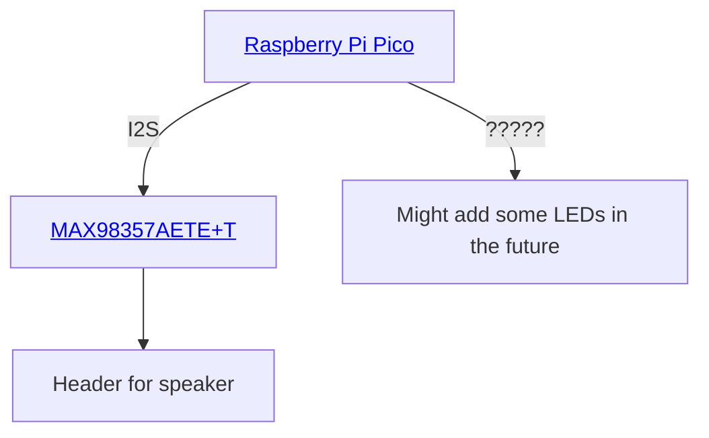

# Pico audio maker

TODO: Add description

TODO: Add photo of completed board

## Block diagram

## Licence

Copyright © 2024 Phil Baldwin

This work is licensed under a Creative Commons Attribution-ShareAlike 4.0 International License.

You should have received a copy of the license along with this work. If not, see <http://creativecommons.org/licenses/by-sa/4.0/>.
